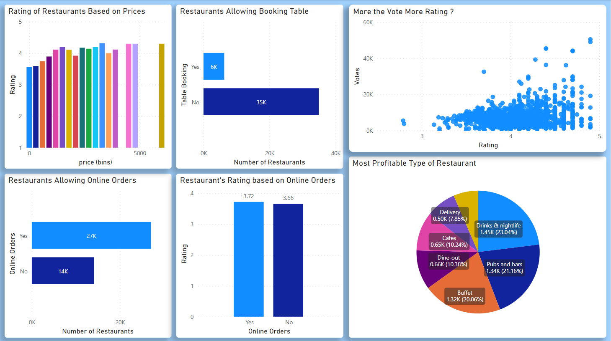

## Zomato Reviews dataset

This data science visualization project is based on the Zomato Reviews dataset, which contains information about various restaurants across different cities in India. The dataset includes data such as restaurant names, cuisines, location, ratings, and reviews.

**Dataset Title**  - *Zomato Reviews* 

**Dataset Source**  - *[Click here](https://www.kaggle.com/datasets/prepinstaprime/tomato-reviews) or
 https://www.kaggle.com/datasets/prepinstaprime/tomato-reviews*

 ### Cleaning Data

I cleaned the data using Pandas Library 

For refrence i have uploaded the **data_cleaning.ipynb** file  which contains all the steps of data cleaning

### Visualization

I realized data still need some cleaning and  decided to use **PowerBi** inbuild features for Data Transformation 

The extract of query editor is also uploaded **query_editor_steps.txt** for refrence

DashBoard

### It Shows

1.  Rating of Restaurants based on Average Prices Resuaurants Charge
2. How Many Resturants Are Allowing Table Booking
3. Resturants With More Votes Have More Ratings ?
4. How many Restaurants are Allowing Online Orders 
5. Does Online Orders Have Any Affects On Rating 
6. Which is Most Profitable Type of Restaurants Based on Charges 

DashBoard File **Zomato_Reviews_DashBoard.pbix** is Uploaded for Reference 

Many Further Visualization can be made on this dataset